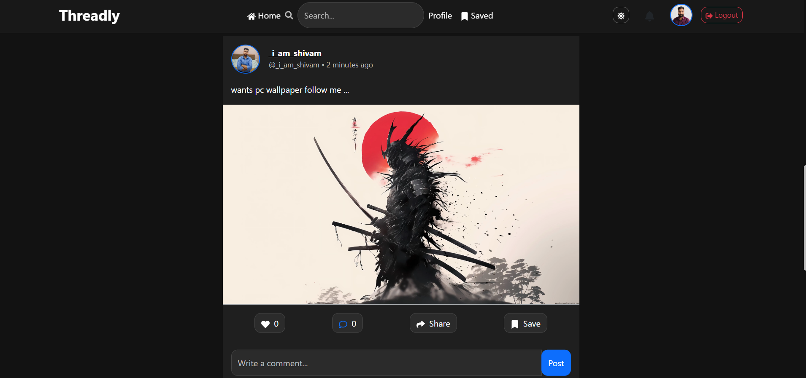
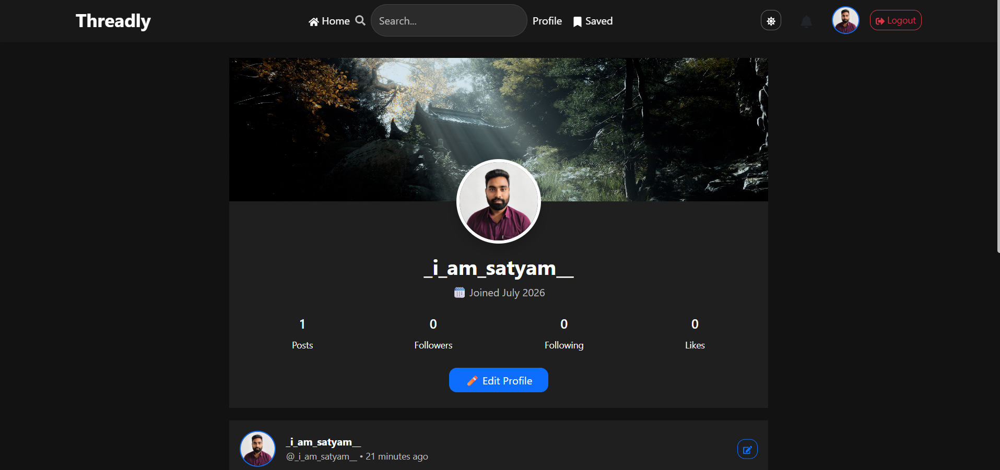

# 🚀 Threadly – A Modern Social Media Platform

<p align="center">


</p>

Threadly is a **full-stack social media platform** inspired by **Threads** and **Instagram**, where users can create posts, upload images, interact with other users, receive notifications, follow profiles, and enjoy a modern responsive interface.

Built using the **MERN Stack**, the project demonstrates authentication, CRUD operations, REST APIs, image uploads, notifications, responsive UI, and modern React development.

---

# 🌐 Live Demo

### 🚀 Frontend

https://threadly-social-app.vercel.app/

### ⚙ Backend API

https://threadly-social-app.onrender.com

### 💻 GitHub Repository

https://github.com/shivamvermajss/threadly-social-app

---

# 📸 Screenshots

## 📰 Feed



---

## 👤 Profile



---

# ✨ Features

## 🔐 Authentication

- User Registration
- Secure Login using JWT
- Protected Routes
- Persistent Login

---

## 👤 User Profile

- Public Profiles
- Edit Profile
- Profile Picture Upload
- Cover Image Upload
- Bio
- Website
- Location
- Follow / Unfollow Users

---

## 📝 Posts

- Create Text Posts
- Upload Images
- Edit Posts
- Delete Posts
- Individual Post Page
- Share Posts
- Copy Share Link
- Native Mobile Sharing

---

## ❤️ Social Features

- Like / Unlike Posts
- Animated Like Button ❤️
- Comment on Posts
- Delete Own Comments
- Save / Unsave Posts
- Search Posts

---

## 🔔 Notifications

- Follow Notifications
- Like Notifications
- Comment Notifications
- Mark as Read
- Navigate directly to Profile/Post

---

## 🎨 UI / UX

- Responsive Design
- Dark Mode
- Toast Notifications
- Loading Indicators
- Image Preview
- Beautiful Bootstrap UI

---

# 🛠 Tech Stack

## Frontend

- React.js
- React Router DOM
- Axios
- Bootstrap 5
- React Icons
- React Toastify
- Date-fns

---

## Backend

- Node.js
- Express.js
- MongoDB
- Mongoose
- JWT Authentication
- Multer
- Cloudinary

---

## Database

- MongoDB Atlas

---

## Image Storage

- Cloudinary

---

# 📂 Folder Structure

```text
Threadly
│
├── backend
│   ├── config
│   ├── controllers
│   ├── middleware
│   ├── models
│   ├── routes
│   ├── server.js
│   └── package.json
│
├── frontend
│   ├── public
│   ├── src
│   │   ├── components
│   │   ├── context
│   │   ├── pages
│   │   ├── services
│   │   ├── App.jsx
│   │   └── main.jsx
│   └── package.json
│
├── screenshots
│   ├── feed.png
│   └── profile.png
│
└── README.md
```

---

# ⚙ Installation

## Clone Repository

```bash
git clone https://github.com/shivamvermajss/threadly-social-app.git
```

---

## Move into Project

```bash
cd threadly-social-app
```

---

## Backend

```bash
cd backend
npm install
npm run dev
```

---

## Frontend

```bash
cd frontend
npm install
npm run dev
```

---

# 🔑 Environment Variables

## Backend (.env)

```env
PORT=5000

MONGO_URI=your_mongodb_connection

JWT_SECRET=your_secret

CLOUDINARY_CLOUD_NAME=your_cloud_name

CLOUDINARY_API_KEY=your_api_key

CLOUDINARY_API_SECRET=your_api_secret
```

---

## Frontend (.env)

```env
VITE_API_URL=http://localhost:5000/api
```

---

# 🌐 API Endpoints

## Authentication

```
POST /api/auth/register
POST /api/auth/login
```

---

## Posts

```
GET    /api/posts
POST   /api/posts
PUT    /api/posts/:id
DELETE /api/posts/:id
POST   /api/posts/:id/like
POST   /api/posts/:id/comment
```

---

## Users

```
GET  /api/users/:username
PUT  /api/users/profile
PUT  /api/users/follow/:id
PUT  /api/users/save/:id
```

---

## Notifications

```
GET /api/notifications
PUT /api/notifications/:id
```

---

# 🚀 Future Improvements

- 💬 Real-Time Chat (Socket.IO)
- 📹 Stories
- 🎥 Reels
- ♾ Infinite Scrolling
- #️⃣ Hashtags
- @️⃣ Mentions
- 📧 Email Verification
- 🔒 Forgot Password
- 👨‍💼 Admin Dashboard
- 📱 Push Notifications

---

# 📚 Learning Outcomes

This project helped me strengthen my understanding of:

- MERN Stack Development
- REST API Design
- JWT Authentication
- MongoDB & Mongoose
- Cloudinary Integration
- React Context API
- CRUD Operations
- Protected Routes
- State Management
- Responsive UI Design
- Full Stack Application Deployment

---

# 👨‍💻 Author

## Shivam Verma

**Full Stack Developer | MERN Stack**

🔗 GitHub

https://github.com/shivamvermajss

🔗 LinkedIn

https://www.linkedin.com/in/shivam-verma-227b37384/

---

# ⭐ Show Your Support

If you found this project useful, consider giving it a ⭐ on GitHub.

It motivates me to build more amazing full-stack applications.
